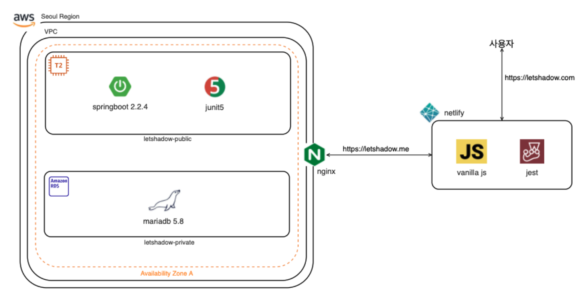

### 원칙

- 필요한 기능을 작게 시작하여 많이 리펙토링 하자

[서비스를 시작하면서](https://www.notion.so/c09531f2efe64d0bbc770f65b96c3acd)

### 요약

- Youtube 동영상의 구간 반복 기능을 제공하여 외국어 회화 학습 기능을 제공

### 배경

- 유튜브에서는 원하는 구간의 반복을 할 수 없다
- 자막을 보면서 어떤 단어인지 검색하기 힘들다

### 목표

**프론트엔드**

- 비디오의 구간 반복기능 제공
- 영어 자막의 단어 번역

**백엔드**

- 구글 로그인
- 사용자 Youtube 계정의 좋아요한 비디오 리스트 API
- Jenkins CI/CD
- SSL 설정

### 목표가 아닌 것

- React, Next, Typescript, Style Component, Storyboot, Cypress
- Elastic Search, QueryDSL, ECS
- 동영상 속도 조절
- 동영상 반복 중 간격조절
- 커뮤니티
- 최근 본 비디오 표시
- 찾은 단어 리스트 저장
- 동영상 플레이 타임에 따라 전체 스크립트에서 해당 시간의 스크립트 문장 하이라이트

### 스펙

프론트엔드

- Javascript ECMA6, Jest

백엔드

- Java 8, SpringBoot 2.2.4, Spring Data Jpa, MariaDB, Junit5, Jenkins, Netlify, Amazon Linux 2

### 스펙 선정 이유

[스펙 선정 기준](https://www.notion.so/8b50f94f8e204aed9f052056b92890c7)

### 계획 (Detail)